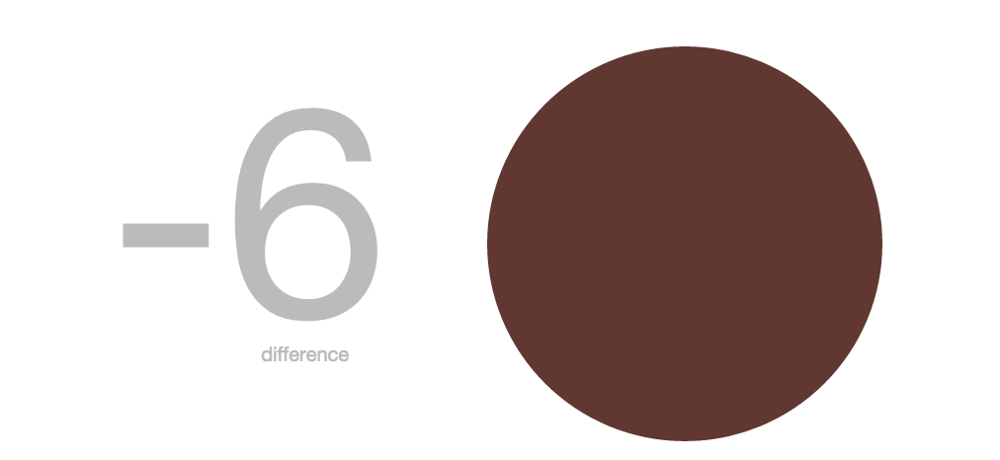

## Data Pulse 

#### A visualization tool that works with streaming data

[Example](http://topleft.github.io/pulse-visual/)



Data Pulse keeps track of a stream of information. It enables you to get a sense of the state of your data by setting colors that represent different conditions.

In the example we are calculating the average amount of social media information, streamed in every 3 seconds, and comparing it to the previous 3 seconds. The difference of information streamed is represented by the pulse and color.

To install locally: 

1. clone down
2. npm install
3. when changes are made to /js/pulse.js or NPM packages are added, run this in your console:

```
browserify ./js/pulse.js -o ./js/bundle.js
```

Have fun! 
